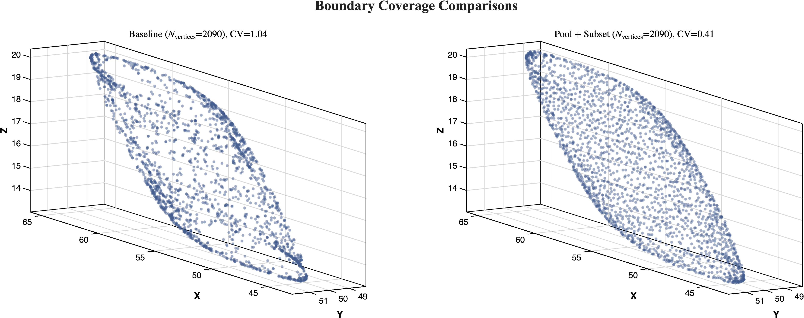

# Improving Uniformity of Vertex Distributions in Spherical Sampling of Metamer Mismatch Body Boundaries

[](https://matlab.mathworks.com/open/github/v1?repo=sfu-cs-vision-lab/uniform-spherical-sampling&project=uniform-spherical-sampling.prj)

[](https://github.com/sfu-cs-vision-lab/uniform-spherical-sampling/actions/workflows/main.yml)


[](https://doi.org/10.xxxx/xxxxx)

This repository contains the MATLAB implementation for the "pool-and-subset" algorithm described in the paper *Improving Uniformity of Vertex Distributions in Spherical Sampling of Metamer Mismatch Body Boundaries*.

<p align="center">
  
</p>

Standard spherical sampling methods for computing Metamer Mismatch Body (MMB) boundaries often produce non-uniform vertex distributions, with significant clustering and sparse regions. Increasing the sampling density ($N_k$) typically adds redundant vertices without resolving this non-uniformity.

This project implements **Algorithm 1** from the paper, a post-processing workflow that improves uniformity while preserving geometric fidelity:

1. **Pool:** Aggregates vertices from multiple independent spherical sampling runs to create a dense candidate set ($V_{pool}$).
2. **Identify Extremes:** Identifies boundary-critical vertices (anchors) by maximizing support functions along quasi-uniform directions. These are force-included to preserve the hull geometry.
3. **Subset:** Fills the remaining vertex budget ($N_{target}$) using Seeded Farthest Point Sampling (FPS), initialized from the retained extremes.

This approach substantially reduces the coefficient of variation (CV) of nearest-neighbor distances compared to baseline sampling, as shown in the figure above.

## Requirements

- MATLAB R2022a or later
- Statistics and Machine Learning Toolbox (for `pdist2`)
- Optimization Toolbox (for `linprog`)

## Quick Start

> **Tip:** Click the "Open in MATLAB Online" badge above to run this project directly in your browser. This will automatically load the project and set up the path.

or 

1. Clone with submodules:

```
git clone --recursive https://github.com/sfu-cs-vision-lab/uniform-spherical-sampling.git
```

2. Open the project in MATLAB:

   *Opening the project will automatically set up the source paths.*
```matlab
openProject("uniform-spherical-sampling.prj")
```

3. Run the getting started example:
```matlab
GettingStarted
```


### Note on Example Files

The `examples/GettingStarted.m` file is saved in the **Plain Text Live Script** format (introduced in MATLAB R2025a).

* **MATLAB R2025a+:** The file will open automatically in the Live Editor with formatted text, equations, and inline output.
* **Older Versions:** The file will open as a standard `.m` script. It is fully executable, but the formatting (headers, descriptions) will appear as raw comments (e.g., `%[text]`).

## Usage

### 1. Pool-and-Subset (Recommended)

Generate uniform vertices using the method described in the paper (Algorithm 1).

```matlab
data = loadMMBTestData();
[V, info] = poolSubsetMMB(data.mech1, data.mech2, data.z0, TargetN=1000, Scale=data.yNormScale);

```

### 2. Baseline Generation

Generate baseline vertices (single spherical sampling run) as described in the paper. Requires the reference interior point (`intPoint`) for the duality transform.

```matlab
data = loadMMBTestData();
V_base = generateMMBVertices(data.sensors, data.nullEqCon, data.x0, data.intPoint, NumNormals=1e5, Scale=data.yNormScale);
```

See [`examples/GettingStarted.m`](examples/GettingStarted.m) for a complete working example with visualization.

## Reproducing Paper Results

The `paperFigures/` directory contains scripts to regenerate all figures and tables from the paper:

```matlab
cd paperFigures
generateAll   % Runs all figure and table generation scripts

```

Individual scripts:

* `generateFigure1.m` - Convex hull visualization
* `generateFigure2.m` - Single-run vertex distribution
* `generateFigure3.m` - Run-to-run variability
* `generateFigure4.m` - CV comparison swarm plots
* `generateFigure5.m` - Baseline vs pool+subset comparison
* `generateTable1.m` - Baseline  sweep results
* `generateTable2.m` - Pool+subset results

Outputs are saved to `paperFigures/output/`.

## Project Structure

```
uniform-spherical-sampling/
├── src/                          # Core algorithm implementation
│   ├── poolSubsetMMB.m
│   ├── generateMMBVertices.m
│   ├── seededFPS.m
│   ├── identifyExtremeVertices.m
│   └── computeNNStats.m
├── paperFigures/                 # Paper figure/table generation
│   ├── generateFigure*.m
│   ├── generateTable*.m
│   ├── generateAll.m
│   └── utils/                    # Shared plotting utilities
├── tests/                        # Unit tests
├── examples/                     # Usage examples
│   └── GettingStarted.m
├── buildUtilities/               # Build task helpers (badge generation)
├── reports/                      # Generated test/coverage reports
├── resources/                    # MATLAB Project configuration files
└── lib/                          # External dependencies (submodules)

```

## Citation

If you use this code in your research, please cite:

```bibtex
@inproceedings{Forsythe2026,
  author    = {Forsythe, Alexander G. and Funt, Brian},
  title     = {Improving Uniformity of Vertex Distributions in Spherical Sampling of Metamer Mismatch Body Boundaries},
  booktitle = {Proceedings of the IS\&T Electronic Imaging Symposium (EI 2026)},
  year      = {2026},
  note      = {In Press}
}
```

This algorithm makes use of the algorithm described in

```bibtex
@article{mackiewicz2018spherical,
  title={Spherical sampling methods for the calculation of metamer mismatch volumes},
  author={Mackiewicz, Michal and Rivertz, Hans Jakob and Finlayson, Graham},
  journal={Journal of the Optical Society of America A},
  volume={36},
  number={1},
  pages={96--104},
  year={2018},
  publisher={Optical Society of America}
}
```

## License

This code is provided under the AGPL v3 License terms specified in the [LICENSE](LICENSE) file

Copyright 2026 Alexander Forsythe and Brian Funt, Simon Fraser University.
